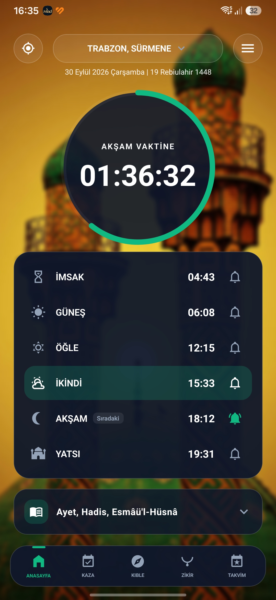
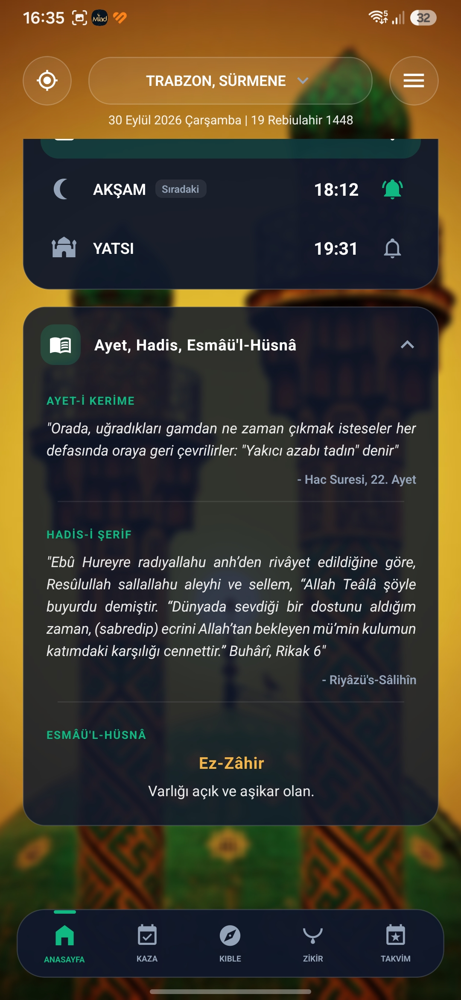
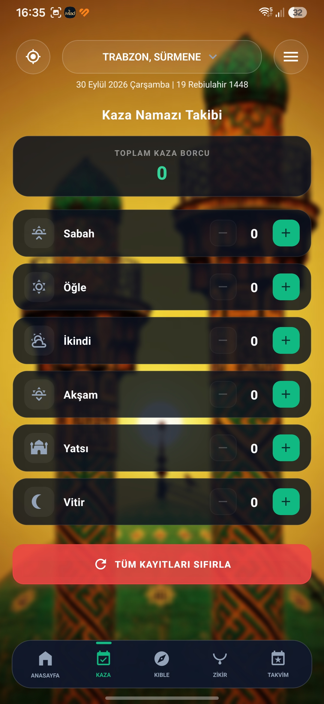
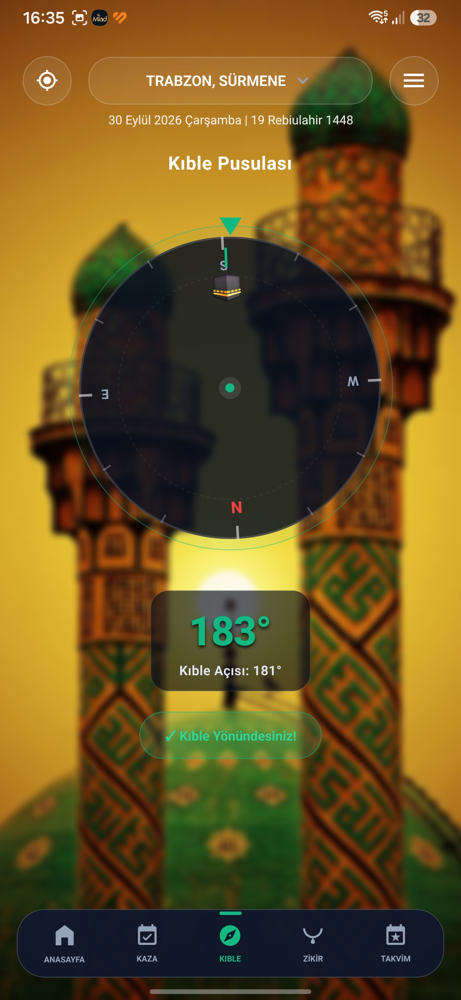
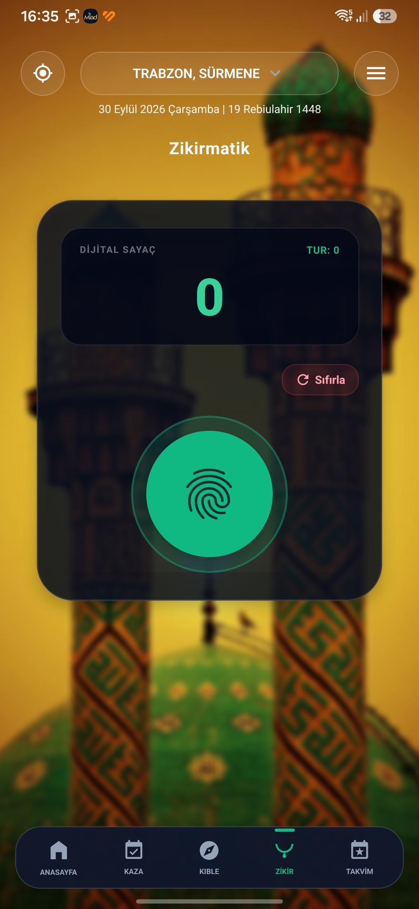
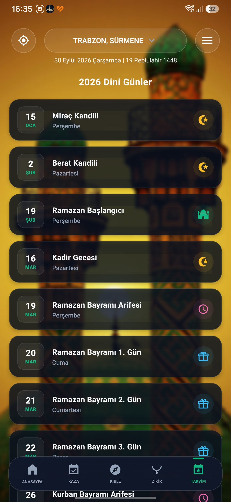
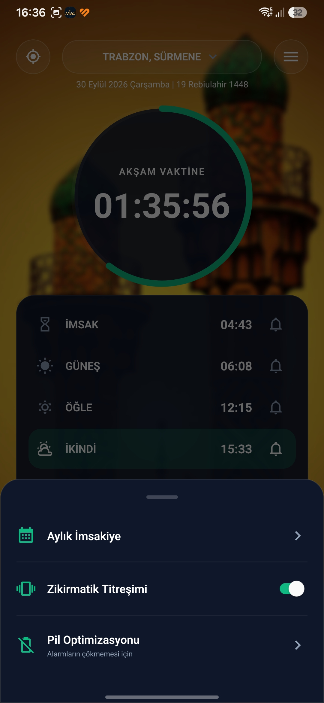

# 🕌 Miad Prayer Time

Modern, minimalist ve "Offline-First" (internetsiz çalışabilen) mimariyle tasarlanmış, **React Native & Expo** tabanlı yeni nesil İslami yaşam ve namaz vakti uygulaması. Apple standartlarında **Glassmorphism (Cam Efekti)** arayüzü ile kullanıcıya huzurlu ve akıcı bir deneyim sunar.

## 📱 Ekran Görüntüleri

<p align="center">
  
  
  
  
</p>
<p align="center">
  
  
  
</p>

## 📥 İndir ve Kur (Kullanıcılar İçin)
Uygulamanın en güncel Android (APK) sürümünü indirmek için sağ taraftaki **Releases** bölümüne gidebilir veya [Releases Sayfasından İndirebilirsiniz](https://github.com/omersengull/Miad-PrayerTime/releases).

---

## 🌟 Öne Çıkan Özellikler

* **⏱️ Kesintisiz ve İsabetli Vakitler:** Diyanet verileriyle %100 uyumlu, cihazın konumunu otomatik bulan (GPS) sistem.
* **📴 Çevrimdışı (Offline) Destek:** API'den 30 günlük veriyi tek seferde önbelleğe (Cache) alır. İnternet bağlantısı olmadan da çalışır.
* **🔔 Gelişmiş Bildirim Motoru:** Android'in çekirdek `Chronometer` API'si ve Kotlin native modülü kullanılarak bildirim çubuğuna sabitlenen ve saniye saniye geriye sayan namaz sayacı.
* **⏰ Özelleştirilebilir Alarmlar:** Her vakit için "Tam Vaktinde", "15, 30, 45 Dakika Önce" gibi yerel bildirim (Local Notification) kurma imkanı.
* **📱 Android Ana Ekran Widget'ı:** Uygulamayı açmadan ana ekrandan anlık vakitleri gösteren modern widget desteği.
* **📿 Akıllı Zikirmatik:** 33'lü döngülerde titreşimli geri bildirim (Haptic Feedback) sağlayan ve turları sayan zikir takip sistemi.
* **🧭 Kıble Pusulası:** Cihazın manyetometre sensörünü kullanarak canlı açı ile hesaplanan Kabe yönü bulucu.
* **📊 Kaza Namazı Takibi:** Geçmişe dönük kılınmamış namazların takibi ve tek tuşla düzenleme paneli.
* **📖 Günün İçeriği & Esmâü'l-Hüsnâ:** Her gün o güne özel Ayet-i Kerîme, Hadis-i Şerif ve Allah'ın 99 ismi anlamlarıyla birlikte ana ekranda sunulur.
* **📅 30 Günlük İmsakiye & 2026 Dini Günler:** Aylık vakit takvimi ve 2026 yılı tüm dini günler/kandiller listesi.

---

## 🛠️ Kullanılan Teknolojiler & Kütüphaneler

* **Framework:** React Native (v0.86), Expo (v57)
* **Veri & Durum Yönetimi:** React Hooks, `@react-native-async-storage/async-storage`
* **Konum & Sensörler:** `expo-location`, `expo-sensors` (Magnetometer)
* **Bildirimler:** `expo-notifications`, `@notifee/react-native`, Özel Kotlin Native Modülü (`MiadNotify`)
* **Widget Motoru:** `react-native-android-widget`
* **Kullanıcı Deneyimi & Tasarım:** `expo-haptics`, `react-native-svg`, Glassmorphism UI

---

## 💻 Geliştiriciler İçin Kurulum (Local Development)

### 1. Gereksinimler
* [Node.js](https://nodejs.org/) (v20 veya üzeri)
* [pnpm](https://pnpm.io/) paket yöneticisi
* Android Studio (Android SDK ve Emülatör kurulumu yapılmış olmalı)
* Global EAS CLI (`npm install -g eas-cli`)

### 2. Kurulum

```bash
# Projeyi bilgisayarınıza klonlayın
git clone https://github.com/omersengull/Miad-PrayerTime.git

# Proje dizinine girin
cd Miad-PrayerTime

# Bağımlılıkları yükleyin
pnpm install
``` 
### 3. Çalıştırma

    Önemli Not: Projede @notifee/react-native, özel MiadNotify Kotlin modülü ve widget gibi Native bileşenler bulunduğu için standart Expo Go uygulamasında çalışmaz. Geliştirme için yerel Android derlemesi (Dev Client) kullanılmalıdır.

Bash

# Android için yerel geliştirici sürümünü (Dev Client) derleyip başlatmak:
pnpm exec expo run:android

# VEYA EAS ile yerel ortamda Development Build almak:
eas build --profile development --platform android --local

# Üretime (Production) hazır APK çıktısı almak:
eas build --profile preview --platform android --local
